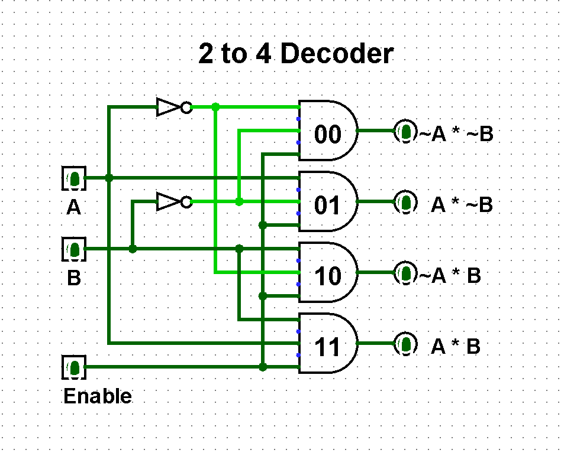
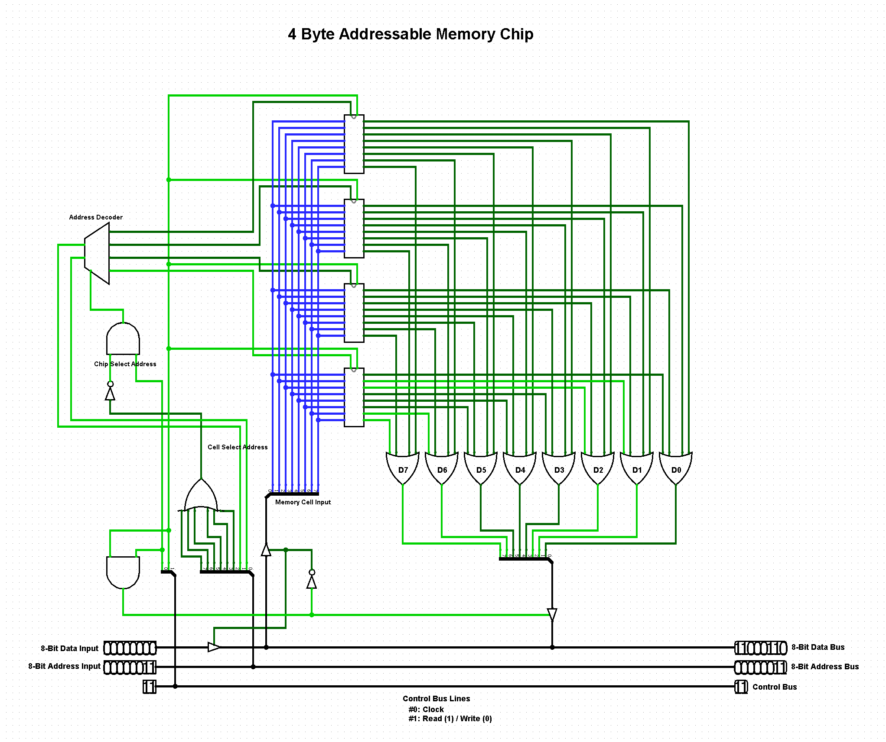
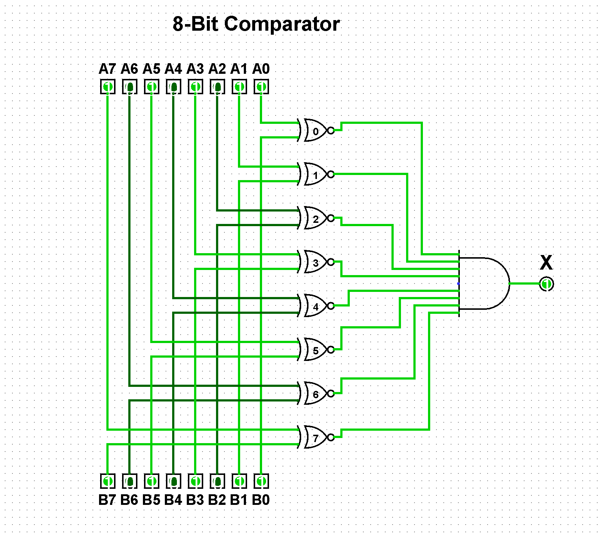
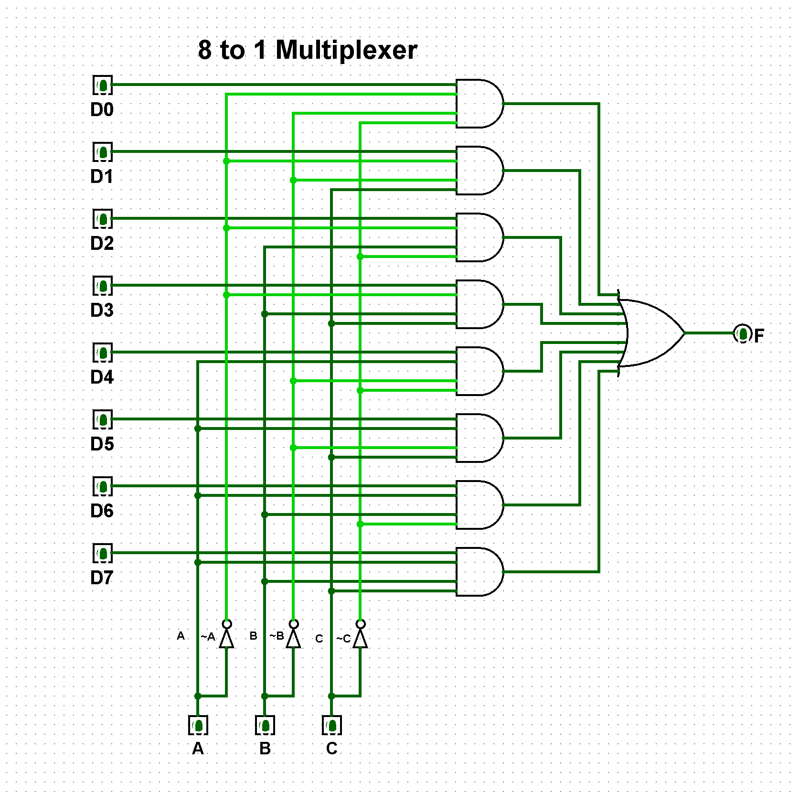

# **Homework I**

The first homework assignment we were given was to create several webpages. We were to use HTML to build the pages, CSS to style them, and Bootstrap to format the layout. I had very little experience with HTML going into this and had never heard of Bootstrap before, so the first thing I did was dive into some documentation. I found [this](https://getbootstrap.com/docs/4.0/components/alerts/) link especially helpful for learning the little things that Bootstrap was capable of, and used them to tailor the pages to my liking.

## **Relevant Links**
- [Home](https://brockv.github.io/)
- [Assignment Page](http://www.wou.edu/~morses/classes/cs46x/assignments/HW1.html)
- [Code Repository](https://github.com/brockv/brockv.github.io/tree/master/CS460/HWK1/demo)
- [Site Demo](https://brockv.github.io/CS460/HWK1/demo/index.html)

### **I: Getting a Repository Setup Through Git**

I had previously set up an account through GitHub so most of the work was done already. After creating the repository in my account, the
next step was to clone it on my local machine using Git Bash since part of the assignment requirements was to use Git strictly from the
command line. After doing so, I created a directory for the repository on my machine, cloned the repository to it, then navigated to the 
directory using the following commands:

```bash
mkdir CS460
git clone https://github.com/brockv/CS460.git
cd CS460
```

Throughout this assignment, I used commands such as add, commit, push, and pull to make changes to the files and to keep the repositories in sync and up to date. Specifically, the 'add' command is used to stage files that have been modified, and 'commit' is used to save the changes. Commits should be accompanied by a message to indicate the changes that were made. The 'push' and 'pull' commands are used to send and retrieve files from the repository, respectively.

```bash
git add file_to_add.html
git commit -m "Fixed a broken link."
git push -u origin master
```

### **II: Creating the Content and Using Bootstrap**

For this assignment there were requirements for the layout, but there were no expectations for the content of the pages themselves. Because of this I opted to focus on presentation instead, and used generic placeholder text and some images from earlier classes. As far as the layout, we were expected to use single and multi-column layouts, and include a table, two different kinds of lists, a navigation bar, and a seperate cascading style sheet (CSS) to style the pages.

Prior to this assignment I had never heard of Bootstrap, and I didn't quite understand how to integrate it into our project. Luckily, it was much easier than I thought it would be. Rather than download Bootstrap, I loaded the links shown below to the head of my files. This allowed me to use the tools provided by Bootstrap to style my pages.

```html
<link rel="stylesheet" href="https://maxcdn.bootstrapcdn.com/bootstrap/4.1.3/css/bootstrap.min.css">
<script src="https://ajax.googleapis.com/ajax/libs/jquery/3.3.1/jquery.min.js"></script>
<script src="https://cdnjs.cloudflare.com/ajax/libs/popper.js/1.14.3/umd/popper.min.js"></script>
<script src="https://maxcdn.bootstrapcdn.com/bootstrap/4.1.3/js/bootstrap.min.js"></script>
```

I decided to use [Brackets](http://brackets.io/) for this assignment as I was familiar with it. It also has a feature called Live Preview, which is exactly what it sounds like -- a live preview of your code in your browser. This sped up the process for me as it allowed me to see changes immediately, without having to leave the editor. I created an empty html file to start with that would serve as the main page for this assignment, and started with the title and navigation bar.

```html
<html lang="en">
    
    <head>
       <!-- BOOTSTRAP -->
       <meta name="viewport" content="width=device-width, initial-scale=1">
       <link rel="stylesheet" href="https://maxcdn.bootstrapcdn.com/bootstrap/4.1.3/css/bootstrap.min.css">
       <script src="https://ajax.googleapis.com/ajax/libs/jquery/3.3.1/jquery.min.js"></script>
       <script src="https://cdnjs.cloudflare.com/ajax/libs/popper.js/1.14.3/umd/popper.min.js"></script>
       <script src="https://maxcdn.bootstrapcdn.com/bootstrap/4.1.3/js/bootstrap.min.js"></script>
    </head>
    
    <body>
       
       <!-- PAGE TITLE -->
       <div class="jumbotron text-center">
           <h1>CS460 Homework I</h1>
           <p>This is the main page for my first homework assignment in CS460!</p> 
       </div>
       
       <!-- NAVBAR / LINKS -->
       <nav class="navbar navbar-expand-sm justify-content-center border-bottom border-top">
            <ul class="navbar-nav">
               <li class="nav-item active">
                   <a class="nav-link" href="#">Home</a>
               </li>
               <li class="nav-item active">
                   <a class="nav-link" href="#">Random</a>
               </li>
               <li class="nav-item active">
                   <a class="nav-link" href="#">Pictures</a>
               </li>
            </ul>
        </nav>
        
    </body>   
</html>

```


With the navigation bar out of the way, I began working on the other requirements for the assignments. For the main page I decided to display some content in multiple columns, and to also have one of the lists.

```html
<div class="container">
           <h3 class= "text-center">Purto oratio tempor nostrud bonorum suavitate est in:<hr/></h3>
           <div class="row">
               
               <!-- LEFT COLUMN -->
               <div class="col-sm-4">
                   <h3>Left Column</h3>
                   <p>Here's some text in the left column...</p>
               </div>
            
              <!-- CENTER COLUMN -->
              <div class="col-sm-4">
                  <h3>Center Column</h3>
                   <p>Here's some text in the center column...</p>
              </div>
            
              <!-- RIGHT COLUMN -->
              <div class="col-sm-4">
                   <h3>Right Column</h3>        
                   <p>Here's some text in the right column...</p>
               </div>
               
               <!-- UNORDERED LIST -->
               <h3 class= "text-center"><hr/>Viris tation partem no quo natum lobortis an usu:<hr/></h3>
               <ul>
                   <li>Lorem.</li>
                   <li>Vestibulum.</li>
                   <li>Sed.</li>
                   <li>Etiam.</li>
              </ul>

           </div>                         
        </div>
```

For the second page I chose to display the table and the second required list.

```html
<div class="container">
    <h3 class= "text-center">Cu vel omnesque nominavi vulputate:<hr/></h3>
    <!-- TABLE -->
    <table class="table">
        <thead class="thead-dark">
            <tr>
                <th>Firstname</th>
                <th>Lastname</th>
                <th>Email</th>
                <th>Phone Number</th>
            </tr>
        </thead>
                
        <tbody>
            <tr>
                <td>Lori</td>
                <td>Guzman</td>
                <td>guzman@example.com</td>
                <td>(971) 989-0237</td>
            </tr>
                    
            <tr>
                <td>Jeff</td>
                <td>Jefferson</td>
                <td>jeff@example.com</td>
                <td>(503) 585-9762</td>
            </tr>
        </tbody>
    </table>
           
    <!-- ORDERED LIST -->
    <h3 class= "text-center"><hr/>Pro possit gubergren ea, quo ad nostrud:<hr/></h3>
    <ol>
        <li>Lorem.</li>
        <li>Vestibulum.</li>
        <li>Sed.</li>
        <li>Etiam.</li>
        <li>Quod.</li>
        <li>In.</li>
    </ol>
</div> 
```

The last page wasn't entirely necessary, as the requirements had been met at this point, but I wanted to see if I could display images of varying sizes nicely in a single column.

```html
<!-- IMAGES IN A SINGLE COLUMN LAYOUT -->
<div class="container">
    <h3 class= "text-center">Ridens expetenda ullamcorper sit ut, veri detraxit:<hr/></h3>
    <div class="col-md-6 mx-auto text-center">
        
        
        
        
    </div>
</div>
```

### **III: Styline the Pages Using a Cascading Style Sheet (CSS)**

Once I was finished with all three pages and I was satisfied with the layouts, it was time to apply some customization. Having used cascading style sheets in the past for Java projects, getting started was easy. I decided to go with a design that included minimal colors used black / white contrast to make the pages stand out. The following is a snippet from my style sheet that I used to apply a custom bottom border to the links in my navigation bar:

```css
.navbar a
{
    float: left;
    display: block;
    color: #000;
    text-align: center;
    justify-content: center;
    padding: 14px 16px;
    text-decoration: none;
    font-size: 17px;
    border-bottom: 2px solid transparent;
}

.navbar a:hover
{
    border-bottom: 2px solid #000;
}

.navbar a.active
{
    border-bottom: 2px solid #000;
}
```

### **IV: Publishing the Pages Using GitPages**

Admittedly, this is the step I had the most trouble with, mostly because I initially had two repositories setup on GitHub. This led to some unexpected behavior on the pages, such as links not going where they should. After banging my head into a wall for a few hours I eventually decided to move everything into a single repository (the one ending in .io), and after restructuring the directories everything worked as it should.
